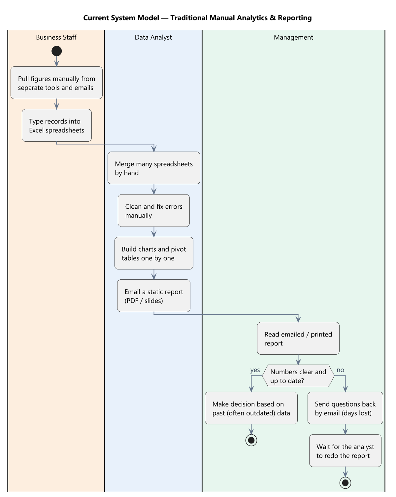
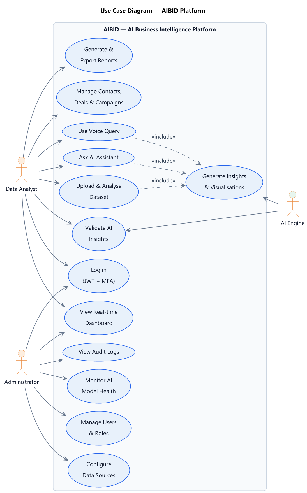
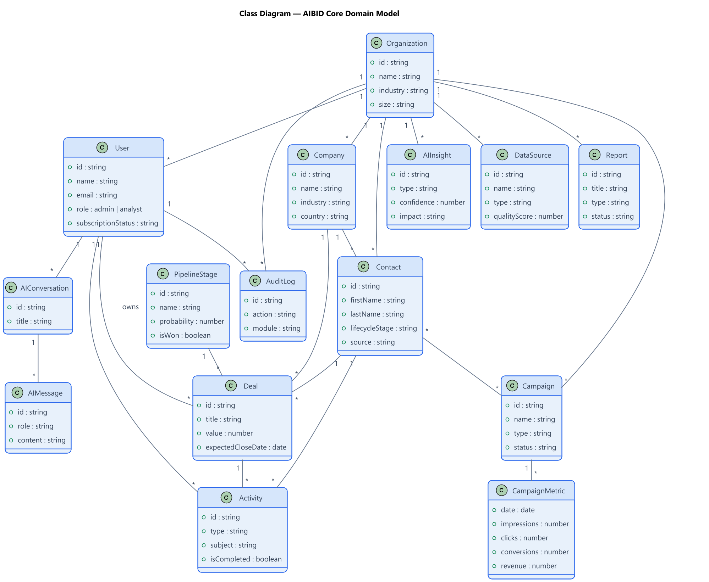
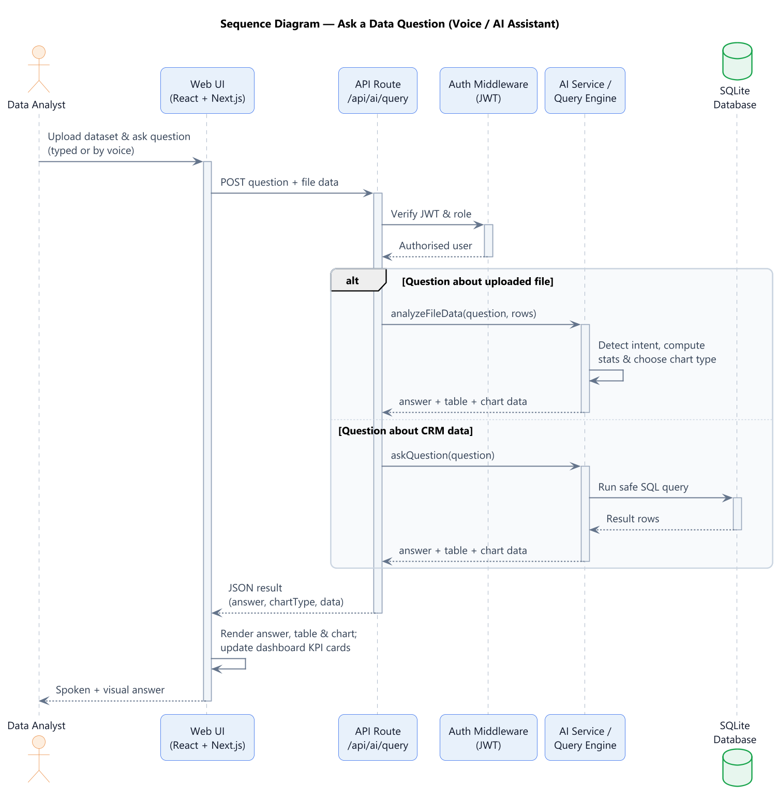
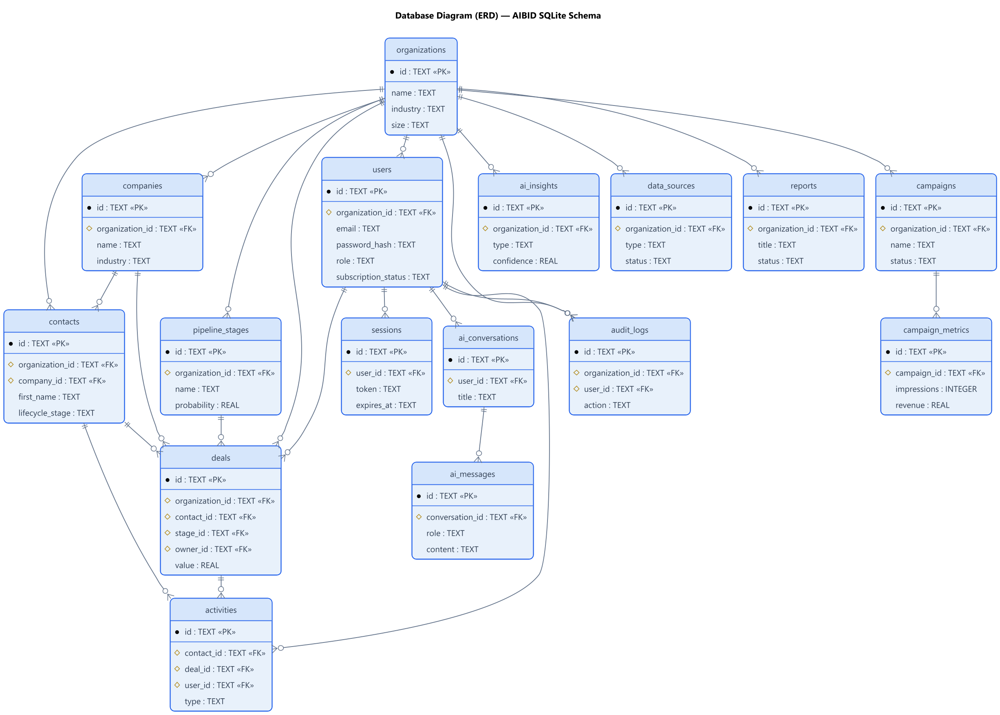
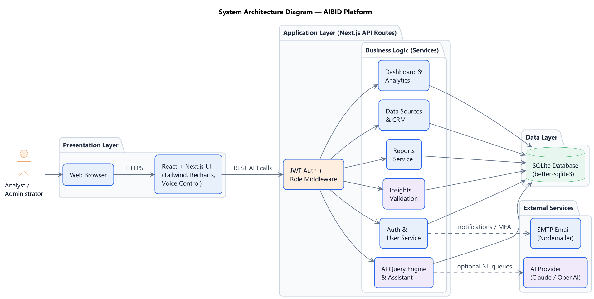

# System Diagrams — AIBID Platform

This folder contains the official system diagrams for **AIBID** (an AI-powered Business Intelligence & CRM platform built with **Next.js 15, TypeScript, SQLite, and JWT authentication**). All diagrams are generated from the **actual implementation** in this codebase — the database schema, API routes, service layer, and authentication mechanism — except the *Current System Model*, which deliberately represents the traditional manual process used **before** AIBID.

Every diagram uses a consistent, professional style: **white background, soft colours (light blue, green, orange), rounded shapes, and clearly readable text** — suitable for a dissertation, final-year project report, or software documentation.

> **Files:** each diagram is available as both **PNG** (`*.png`, high resolution) and **SVG** (`*.svg`, vector). The editable source is the matching `*.puml` (PlantUML) file. Regenerate any diagram with:
> `java -jar plantuml.jar -tpng <name>.puml`

---

## 1. Current System Model



Represents the **traditional, manual analytics and reporting process** that organisations typically use today — *before* adopting AIBID. Business staff pull figures by hand from scattered tools and emails into spreadsheets; a data analyst merges, cleans, and charts everything manually, then emails a static report; management reads outdated reports and often sends questions back, losing days. There is no automation, no real-time data, and no AI — which is exactly the gap AIBID solves.

---

## 2. Use Case Diagram



Shows **who does what** in AIBID. The two human roles found in the code are the **Data Analyst** and the **Administrator**, plus the **AI Engine** as a supporting actor. Analysts log in, view the real-time dashboard, ask the AI Assistant, use voice queries, upload and analyse datasets, validate AI insights, generate reports, and manage CRM records. Administrators additionally manage users and roles, configure data sources, view audit logs, and monitor AI model health. The AI features all *include* automatic insight and visualisation generation.

---

## 3. Class Diagram



The **core domain model** behind the application, derived from the database entities and service layer. It shows the main objects — Organization, User, Company, Contact, Pipeline Stage, Deal, Activity, Campaign, Campaign Metric, AI Conversation, AI Message, AI Insight, Data Source, Report, and Audit Log — with their key attributes and the relationships between them (for example, an Organization has many Users, a Deal belongs to a Contact, a Stage, and an owning User, and an AI Conversation contains many AI Messages).

---

## 4. Sequence Diagram



Traces AIBID's signature interaction — **asking a data question by voice or through the AI Assistant**. The analyst uploads a dataset and asks a question; the request hits the `/api/ai/query` route, where JWT middleware verifies the user and role. If the question is about the uploaded file, the in-memory **Query Engine** detects the intent, computes the statistics, and chooses the chart type; if it is about CRM data, a safe SQL query runs against SQLite. The result (answer + table + chart data) is returned and the UI renders the visualisation and updates the dashboard cards.

---

## 5. Database Diagram (ERD)



The **entity-relationship diagram** of the SQLite database, taken directly from the schema. It shows the core tables — organizations, users, sessions, companies, contacts, pipeline_stages, deals, activities, campaigns, campaign_metrics, ai_conversations, ai_messages, ai_insights, data_sources, reports, and audit_logs — with their primary keys (PK), foreign keys (FK), and crow's-foot relationships. Everything is scoped to an organization, giving the platform multi-tenant data isolation.

---

## 6. System Architecture Diagram



A **layered view** of how AIBID is built. The **Presentation Layer** is the React + Next.js browser UI (Tailwind, Recharts, voice control). The **Application Layer** is Next.js API routes guarded by JWT authentication and role middleware, calling a set of business-logic services (Auth, Dashboard & Analytics, AI Query Engine, Insights Validation, Reports, Data Sources & CRM). The **Data Layer** is the SQLite database. External services — an optional AI provider (Claude / OpenAI) and SMTP email — are integrated at the edges.

---

### How these diagrams were generated

- **Tool:** [PlantUML](https://plantuml.com) (`plantuml.jar`, included in this folder) running on Java, using the built-in **Smetana** layout engine (no Graphviz required).
- **Theme:** a shared `theme.puml` file enforces the white background and soft colour palette across every diagram for visual consistency.
- **Sources:** `current-system-model.puml`, `use-case-diagram.puml`, `class-diagram.puml`, `sequence-diagram.puml`, `database-diagram.puml`, `system-architecture-diagram.puml`.
- **Regenerate everything:**
  ```bash
  java -jar plantuml.jar -tpng *.puml      # PNG (high-res)
  java -jar plantuml.jar -tsvg *.puml      # SVG (vector)
  ```
